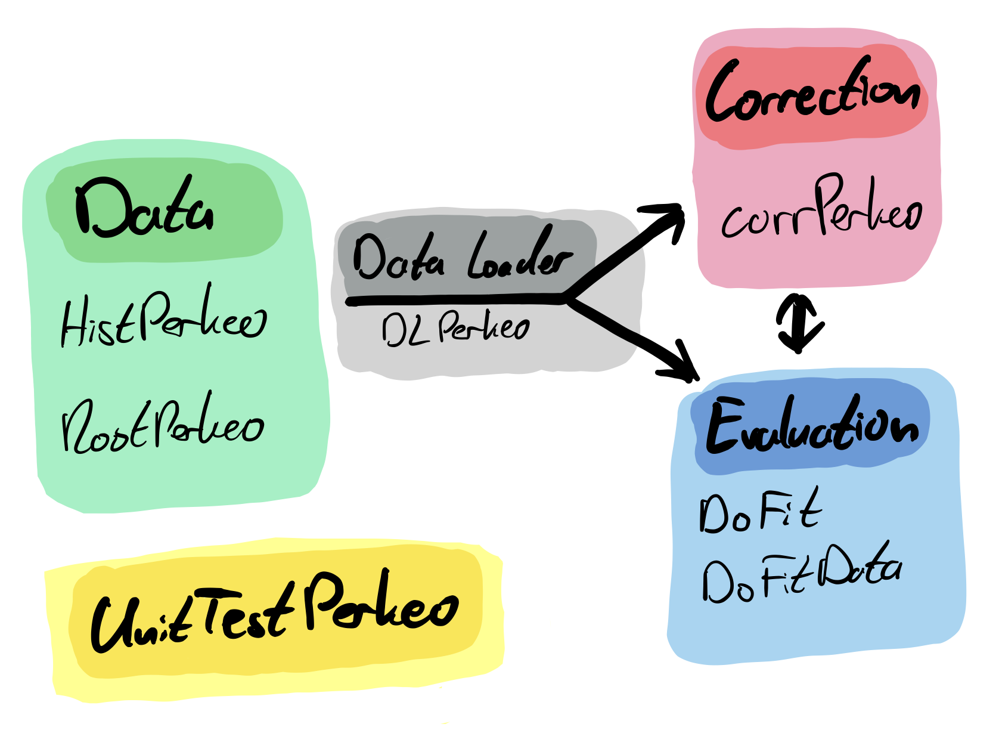

# panter

_panter_ (**P**erkeo **AN**alysis **T**ool for **E**valuation and **R**eduction) is a Python package for reducing, evaluating and analyzing PERKEO III data.

Created and maintained by [Max Lamparth](https://gitlab.lrz.de/ge39dat)

## Project status

This project is very much WIP and changes are constantly being made. Feel free to contact [me](mailto:max.lamparth@tum.de?subject=panter) for feedback and issues.
Currently, even core features are still implemented and can be subject to change.

## Usage

### Installation

Get the package from gitlab: https://gitlab.lrz.de/perkeo/panter

Python version 3.8 or above required.

```bash
git clone https://gitlab.lrz.de/perkeo/panter.git
pip3 install -r requirements.txt
```

### Getting started

_panter_ has several core classes. Their relationship is illustrated below in the schematic.



See docstrings and python help() function for manuals and examples. Core classes are listed below.
In _panter/applications/panter_example.py_ additional, but shorter examples can be found as well.

```python
# Core data structure
from panter.core.dataPerkeo import HistPerkeo, RootPerkeo

help(HistPerkeo)
help(RootPerkeo)
# Data loader
from panter.core.dataloaderPerkeo import DLPerkeo

help(DLPerkeo)
# General Fitter and specific fitting analysis
from panter.core.evalPerkeo import DoFit, DoFitData

help(DoFit)
help(DoFitData)
# Data reduction and correction class
from panter.core.corrPerkeo import CorrPerkeo

help(CorrPerkeo)
```

### File structure

1. Core classes are in _panter/core/_
2. Config files, ini files and derived evaluation parameters are in _panter/config/_
3. Applications based on core classes are in _panter/application/_
4. Default output directory is _panter/output/_
5. Unit tests and their base class are in _tests/_

## Development

### Design decisions

1. Style guide: [pep8](https://www.python.org/dev/peps/pep-0008/)
2. Docstring convention: [numpy](https://numpydoc.readthedocs.io/en/latest/format.html)
3. Ideally, you should use [black](https://pypi.org/project/black/) as code formatter.

**Maximum line length is 88** (default black enforced line length).

### Unit tests

All unit tests can be found in the _tests_ directory. Run _alltests.py_ for all of them.

## License
[MIT](https://choosealicense.com/licenses/mit/)
